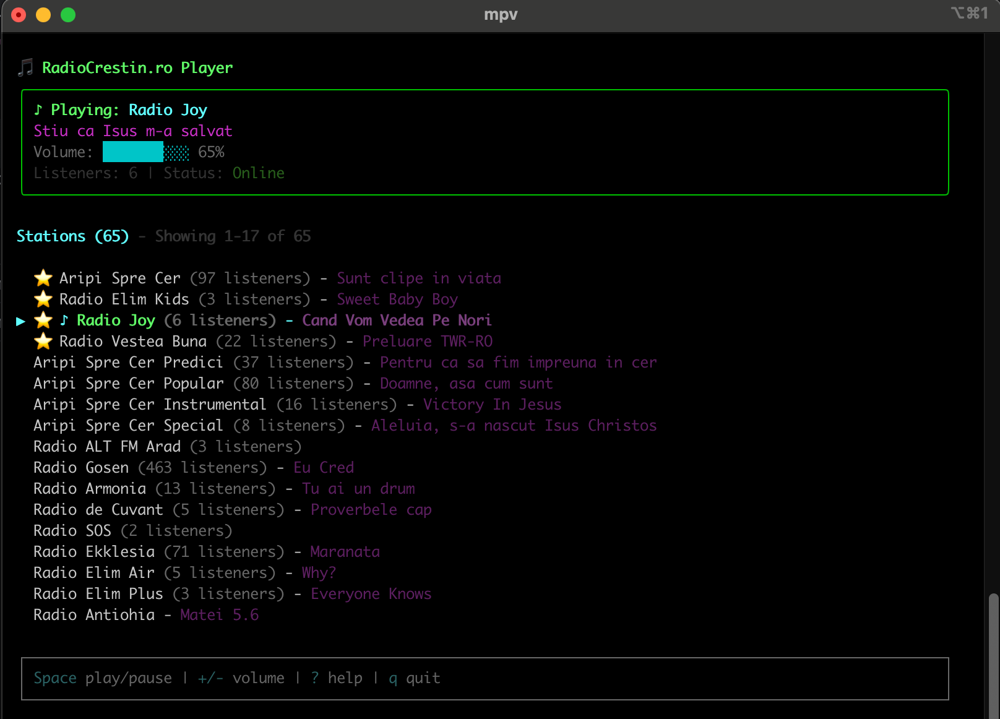

# RadioCrestin.ro CLI Player 🎵

A beautiful terminal-based radio player for [RadioCrestin.ro](https://radiocrestin.ro) stations. Listen to Romanian Christian radio stations directly from your command line with an intuitive interface and powerful features.


## Screenshot



## Features

✨ **Beautiful Terminal UI** - Built with Ink (React for CLI) for a smooth, interactive experience
🎵 **70+ Radio Stations** - Access all RadioCrestin.ro stations
⭐ **Favorites System** - Mark your favorite stations for quick access
🔍 **Live Search** - Filter stations as you type
📻 **Now Playing Info** - See current song, artist, and listener count
🎚️ **Volume Control** - Adjust volume with keyboard shortcuts
⏯️ **Media Controls** - OS-level media keys support (play/pause/next/previous)
🔄 **Smart Streaming** - Automatic fallback between multiple stream formats (Direct, HLS, Proxy)
💾 **Persistent Config** - Favorites and preferences saved across sessions
📦 **Auto-Install** - MPV downloaded automatically on first run (~30MB)

## Installation

### Quick Start (npx - Recommended)

No installation needed! Just run:

```bash
npx radiocrestin
```

The first time you run it, MPV will be downloaded automatically (~30MB). Subsequent runs are instant.

### Global Install

```bash
npm install -g radiocrestin
radiocrestin
```

## Usage

Simply run the command and use your keyboard to navigate:

```bash
npx radiocrestin
```

## Keyboard Shortcuts

| Key | Action |
|-----|--------|
| `↑` / `↓` or `j` / `k` | Navigate stations |
| `Enter` | Play selected station |
| `Space` | Pause/Resume |
| `f` | Toggle favorite for selected station |
| `+` / `-` | Volume up/down |
| `m` | Mute/Unmute |
| Type any text | Search/filter stations |
| `Escape` | Clear search |
| `q` or `Ctrl+C` | Quit |

## Interface

```
🎵 RadioCrestin.ro CLI Player

╭─────────────────────────────────────────────────────╮
│ ♪ Playing: Aripi Spre Cer                          │
│ Paul Wilbur - You Are Holy                         │
│ Volume: ██████████ 100%                             │
│ Listeners: 156 | Status: Online                     │
╰─────────────────────────────────────────────────────╯

╭─────────────────────────────────────────────────────╮
│ Search: paul                                        │
╰─────────────────────────────────────────────────────╯

Stations (73)
  ▶ ⭐ ♪ Aripi Spre Cer (156 listeners) - Paul Wilbur - You Are Holy
    ⭐ Radio Vocea Evangheliei (89 listeners) - Unknown
    Radio Trinitas (234 listeners) - Morning Worship

╭─────────────────────────────────────────────────────╮
│ Keyboard Shortcuts                                  │
│ ↑/↓ or j/k - Navigate stations                     │
│ Enter - Play selected station                       │
│ ...                                                 │
╰─────────────────────────────────────────────────────╯
```

## Features in Detail

### Favorites

- Press `f` to mark a station as favorite
- Favorites appear at the top of the list with a ⭐ icon
- Favorites are saved across sessions

### Search

- Start typing to activate search mode
- The station list filters in real-time
- Press `Escape` to clear search
- Search works on station names and descriptions

### Smart Streaming

The player automatically tries multiple stream formats:

1. Streams are sorted by the `order` field from the API
2. If a stream fails, it automatically tries the next one
3. Supports Direct, HLS, and Proxy streams
4. Automatic retry with exponential backoff

### Volume Control

- Use `+`/`-` to adjust volume in 5% increments
- Press `m` to toggle mute
- Volume level is saved and restored on next launch
- Volume bar shows current level visually

### OS Media Controls

The player integrates with your operating system's media controls:

- **macOS**: Media keys work automatically
- **Windows**: Media keys work automatically
- **Linux**: Media keys work with MPV's built-in support

You can use your keyboard's play/pause, next/previous buttons to control playback even when the terminal is not in focus.

## System Requirements

- **Node.js**: 18.0.0 or higher
- **Operating System**: Windows, macOS, or Linux
- **Internet Connection**: Required for streaming

## MPV Installation

The CLI automatically downloads and installs MPV on first run. If you prefer to install MPV manually:

### macOS

```bash
brew install mpv
```

### Linux (Ubuntu/Debian)

```bash
sudo apt install mpv
```

### Windows

```bash
choco install mpv
```

Or download from [mpv.io](https://mpv.io/installation/)

## Troubleshooting

### MPV Download Fails

If automatic MPV download fails, install it manually (see above) and the CLI will detect it automatically.

### Streams Not Playing

1. Check your internet connection
2. Try a different station
3. The player will automatically try alternative streams

### No Sound

1. Check your system volume
2. Press `m` to unmute
3. Use `+` to increase volume
4. Verify MPV is working: `mpv --version`

### Terminal Display Issues

- Ensure your terminal supports Unicode and colors
- Try a different terminal emulator
- Resize your terminal window if the display looks broken

### Permission Errors

On some systems, you may need to run with elevated permissions:

```bash
sudo npx radiocrestin
```

## Configuration

Configuration is stored in platform-appropriate locations:

- **macOS**: `~/Library/Preferences/radiocrestin-nodejs/`
- **Windows**: `%APPDATA%\radiocrestin-nodejs\Config\`
- **Linux**: `~/.config/radiocrestin-nodejs/`

## Development

### Clone & Install

```bash
git clone https://github.com/iosifnicolae2/radiocrestin.git
cd radiocrestin
npm install
```

### Build

```bash
npm run build
```

### Dev Mode (Watch)

```bash
npm run dev
```

### Run Locally

```bash
npm start
```

## Architecture

```
src/
├── components/          # Ink React components
│   ├── App.tsx         # Main app with state
│   ├── StationList.tsx # Interactive station list
│   ├── NowPlaying.tsx  # Now playing display
│   ├── SearchInput.tsx # Search input
│   └── Help.tsx        # Keyboard shortcuts help
├── services/
│   ├── player.service.ts       # MPV IPC wrapper
│   ├── stream.service.ts       # Stream fallback logic
│   ├── api.service.ts          # RadioCrestin.ro API
│   ├── favorites.service.ts    # Config storage
│   ├── mpv-installer.service.ts # MPV detection/install
│   └── mpv-downloader.service.ts # MPV download
├── utils/
│   └── platform.ts     # Platform detection
├── types/
│   └── station.ts      # TypeScript types
└── cli.tsx             # CLI entry point
```

## Technology Stack

- **Ink** - React for CLI interfaces
- **MPV** - Audio playback engine
- **TypeScript** - Type safety
- **esbuild** - Fast builds
- **conf** - Configuration storage
- **axios** - HTTP client

## API

Data is fetched from the official RadioCrestin.ro API:

```
https://api.radiocrestin.ro/api/v1/stations?timestamp=<unix_timestamp>
```

The timestamp is rounded to 10-second intervals for efficient caching.

## Contributing

Contributions are welcome! Please feel free to submit a Pull Request.

## License

MIT © Iosif Nicolae

## Support

- Report issues: [GitHub Issues](https://github.com/iosifnicolae2/radiocrestin/issues)
- RadioCrestin.ro: [https://radiocrestin.ro](https://radiocrestin.ro)

## Acknowledgments

- RadioCrestin.ro for providing the API and streaming service
- MPV team for the excellent media player
- Ink team for the beautiful CLI framework

---

**Enjoy listening to RadioCrestin.ro! 🎵**
